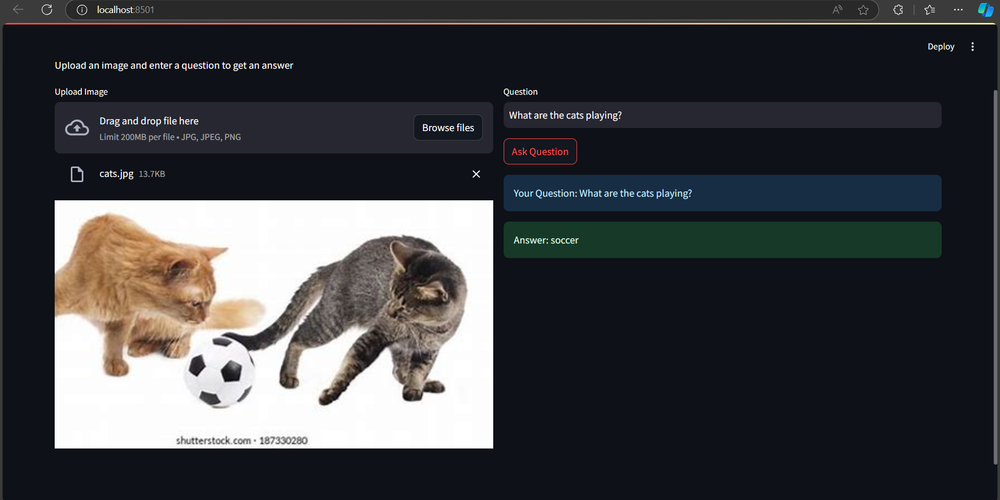

# 🤖 Visual Question Answering (VQA) Tool

## 🌟 Project Overview

Unlock the power of AI-driven image understanding with our cutting-edge Visual Question Answering tool! Leveraging the advanced ViLT (Vision-and-Language Transformer) model, this innovative application allows users to upload images and ask intelligent questions about their contents.

## ✨ Key Features

- 🖼️ **Image-Text Interaction**: Upload any image and ask questions
- 🧠 **Advanced AI Model**: Powered by ViLT Transformer
- 🌐 **Dual Interface**: 
  - FastAPI Backend for programmatic access
  - Streamlit Frontend for interactive user experience
- 🚀 **Intelligent Answers**: Receive contextual responses about image contents

## 🛠 Technology Stack

- **AI Model**: Hugging Face Transformers (ViLT)
- **Backend**: FastAPI
- **Frontend**: Streamlit
- **Machine Learning**: PyTorch
- **Language**: Python 3.8+

## 🚀 Quick Start Guide

### Prerequisites

Before you begin, ensure you have:
- Python 3.8+
- Conda (recommended)
- pip package manager

### Installation Steps

1. **Clone the Repository**
   ```bash
   git clone https://github.com/dinesh-gaire/Visual-QA-tool-using-ViLT-open-source-model.git
   cd Visual-QA-tool-using-ViLT-open-source-model
   ```

2. **Create Conda Environment**
   ```bash
   conda create --name vqa-env python=3.8
   conda activate vqa-env
   ```

3. **Install Dependencies**
   ```bash
   pip install -r requirements.txt
   ```

## 💻 Running the Application

#### Streamlit Demo:


#### FastAPI Demo:


### FastAPI Backend
```bash
uvicorn api:app --reload
```
🌐 Access at: `http://127.0.0.1:8000`

### Streamlit Frontend
```bash
streamlit run app.py
```
🖥️ Access at: `http://localhost:8501`

## 🔍 How It Works

### User Workflow
1. 📤 Upload an Image
2. ❓ Ask a Question
3. 🤖 Receive AI-Generated Answer

### Supported Interactions
- Describe image contents
- Answer specific questions
- Provide contextual insights

## 🌈 Example Use Cases

- 🏞️ Describe landscape details
- 🍽️ Identify objects in a scene
- 📚 Extract text from images
- 🧩 Understand complex visual scenarios

## 🛡️ API Endpoint Details

### `/answer` Endpoint
- **Method**: POST
- **Inputs**: 
  - `image`: Image file
  - `text`: Question text
- **Output**: JSON with AI-generated answer

### Example cURL Request
```bash
curl -X POST "http://127.0.0.1:8000/answer" \
     -F "image=@path/to/image.jpg" \
     -F "text=What is in this image?"
```

## 🤝 Contribution Guidelines

### Ways to Contribute
- Report Bugs
- Suggest Features
- Improve Documentation
- Submit Pull Requests

### Contribution Steps
1. Fork the Repository
2. Create a Feature Branch
3. Implement Changes
4. Submit a Pull Request

## 🏆 Key Advantages

- 🚀 Rapid Image Understanding
- 💡 Contextual AI Insights
- 🔬 Advanced Machine Learning
- 🌐 Multiple Access Methods

## 📄 License

MIT License - See `LICENSE` file for details.

## 🙏 Acknowledgments

Special thanks to:
- Hugging Face Transformers
- FastAPI Team
- Streamlit Community

---

**Disclaimer**: This is an AI-assisted tool. Results may vary based on image complexity and question specificity.

## 📞 Support

Need help? [Open an Issue](your-github-repo-issues-link)
